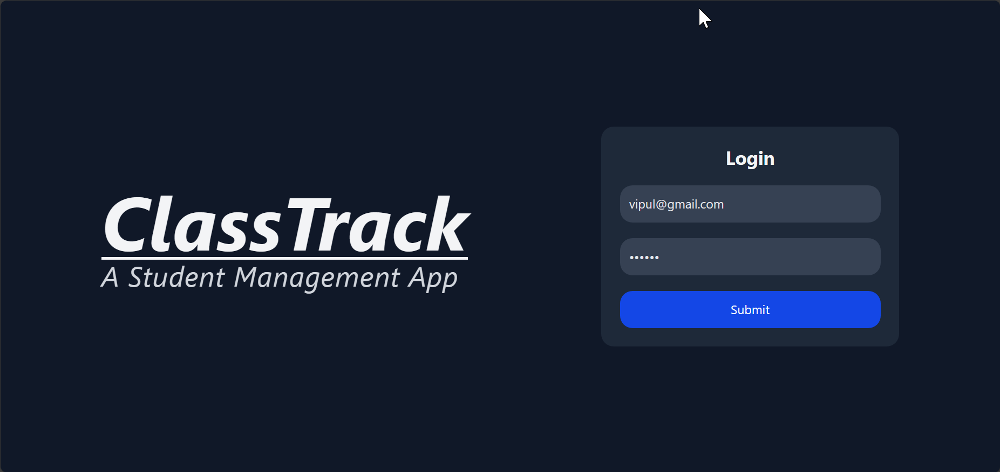
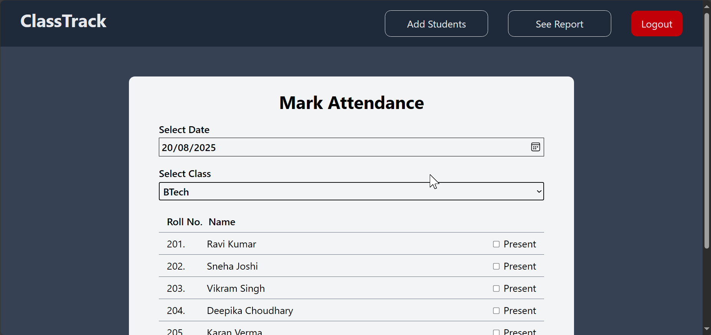
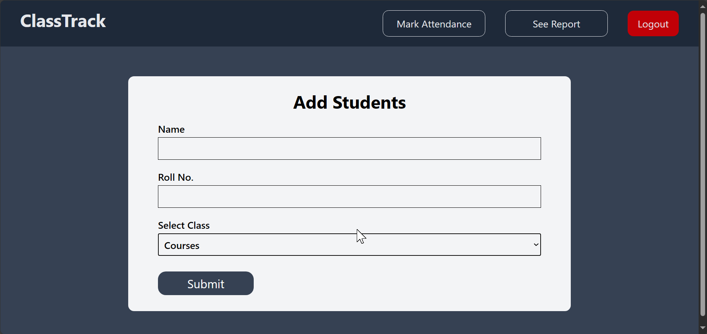
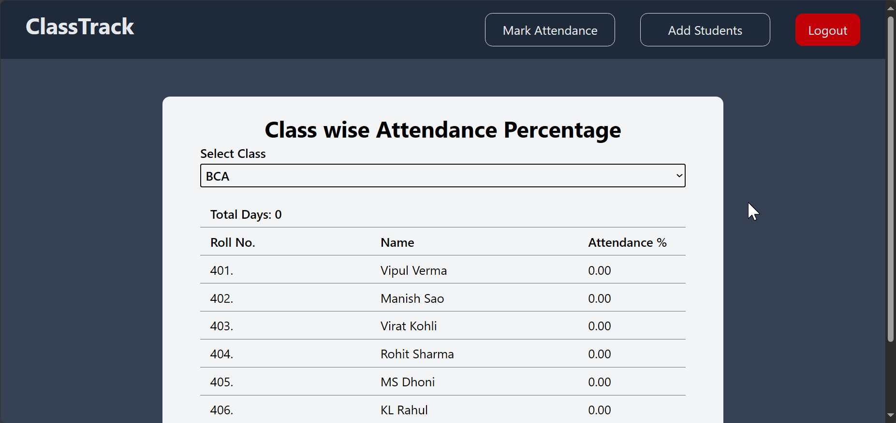

# ClassTrack

**ClassTrack** is a full-stack MERN (MongoDB, Express.js, React, Node.js) application built for teachers to efficiently manage and track student attendance. Teachers can securely log in, add students, mark attendance datewise and classwise, and generate classwise attendance reports with percentages.

---

##  Features

- Secure teacher login with provided credentials.
- Add students with roll number, class, and name.
- Mark attendance by date and class.
- View classwise attendance reports with student name, roll number, and attendance percentage.
- RESTful API using Express and MongoDB.

##  Tech Stack

###  Frontend

- **React** 
- **React Router DOM** 
- **Tailwind CSS**
- **Vite** 
- **Axios**  
- **react-toastify** 

###  Backend

- **Node.js**
- **Express** 
- **MongoDB** + **Mongoose** 
- **dotenv** 
- **cors** 
- **nodemon**
- **bcryptjs**
- **cookie-parser**
- **jsonwebtoken**

---
##  Screenshots

### Teachers Login

### Mark Attendance

### Add Students

### See Report

